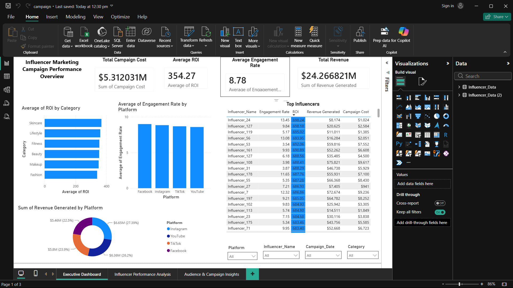
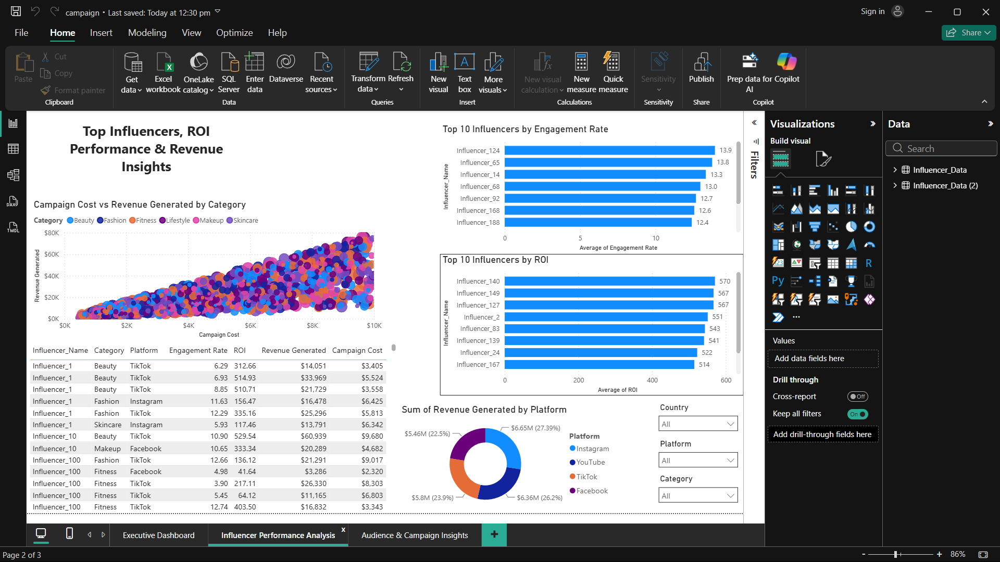
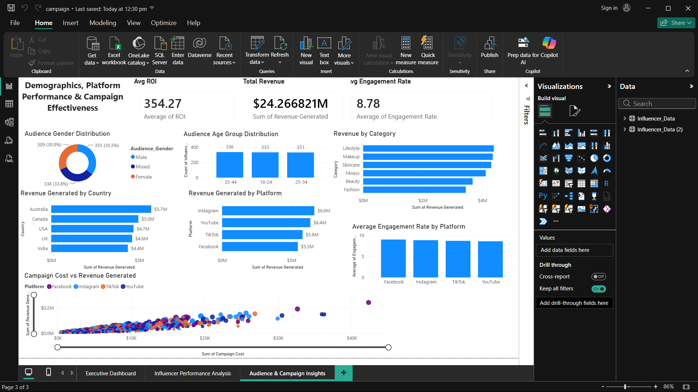

# 📊 Influencer Marketing Analytics Dashboard (Power BI)

## 📌 Project Overview

This project analyzes influencer marketing campaign performance using an interactive Power BI dashboard. It helps marketing teams evaluate campaign effectiveness, identify top-performing influencers, and optimize marketing strategies through data-driven insights.

---

## 🎯 Business Problem

Brands invest heavily in influencer marketing but often struggle to measure campaign performance across different platforms and audience segments.

This dashboard provides a centralized view of campaign metrics to support better marketing decisions.

---

## 📂 Dataset

The dataset contains information about:

- Influencer Name
- Platform
- Category
- Country
- Audience Age Group
- Engagement Rate
- Revenue
- ROI
- Impressions
- Clicks
- Conversions
- Campaign Cost

---

## 📈 Dashboard Features

- Executive KPI Cards
- Revenue Analysis
- ROI Analysis
- Platform Comparison
- Category Performance
- Audience Demographics
- Influencer Ranking
- Interactive Filters (Slicers)
- Drill-through Navigation
- Tooltips

---

## 🛠️ Tools Used

- Power BI
- Power Query
- DAX
- Microsoft Excel

---

## 📷 Dashboard Preview

### Executive Dashboard

### Influencer Performance Analysis

### Audience & Campaign Insights

---

## 💡 Key Insights

- Identified top-performing influencers based on ROI.
- Compared campaign performance across platforms.
- Analyzed audience demographics and engagement.
- Evaluated category-wise revenue trends.
- Designed interactive dashboards for business decision-making.

---

## 🚀 Skills Demonstrated

- Data Cleaning
- Data Transformation
- Data Modeling
- DAX Calculations
- Data Visualization
- Dashboard Design
- Business Intelligence

---

## 👨‍💻 Author

**Cherukuru Uday Chowdary**

GitHub:
https://github.com/CherukuruUdayChowdary